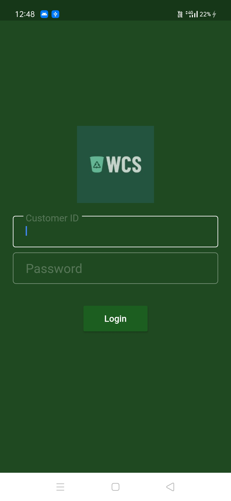
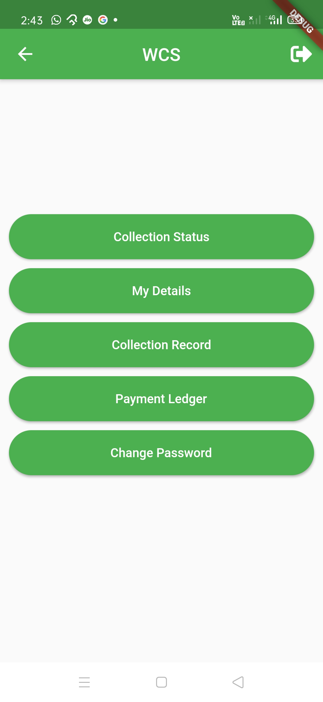
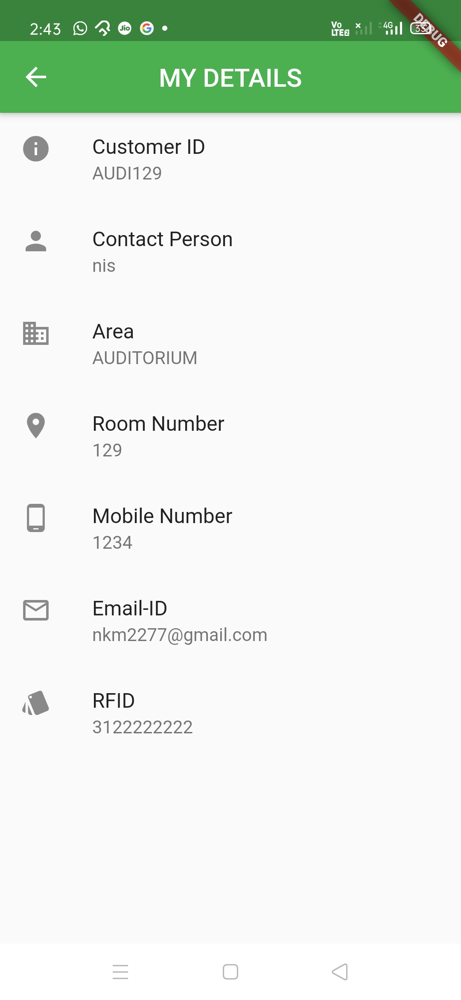
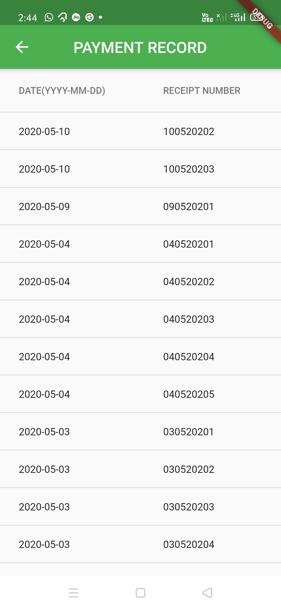
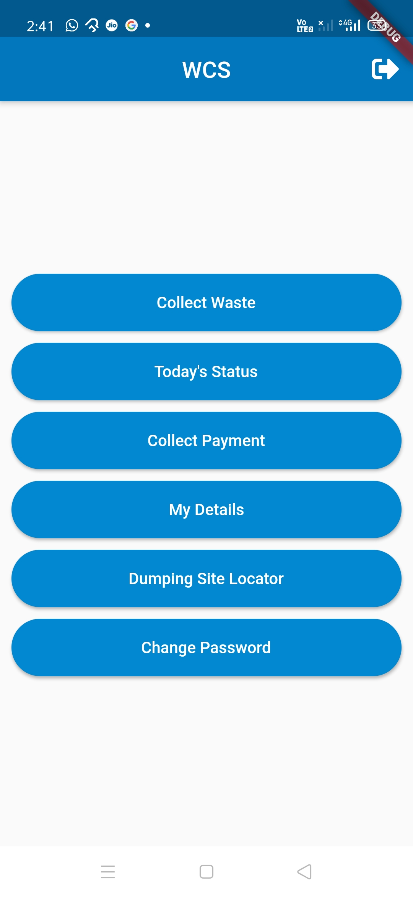
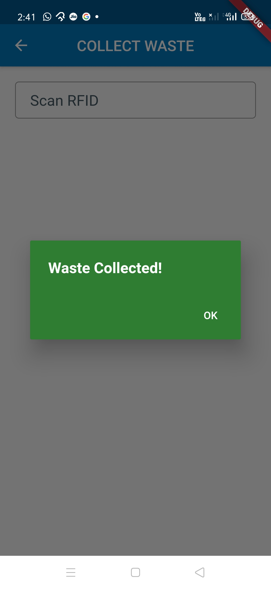
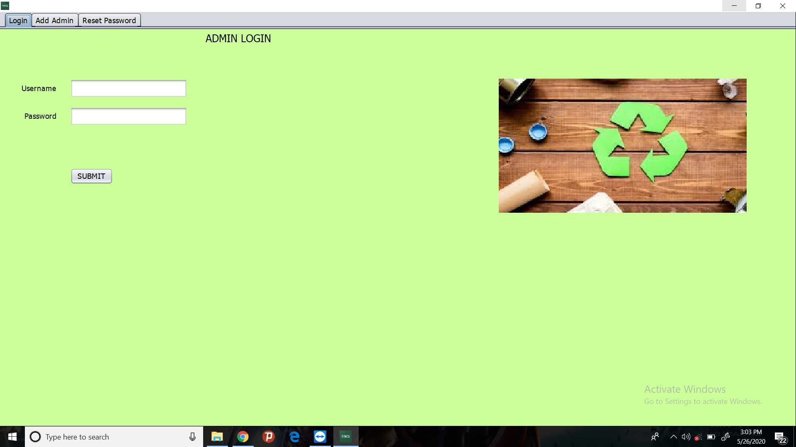
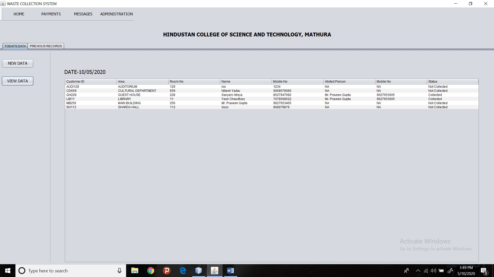
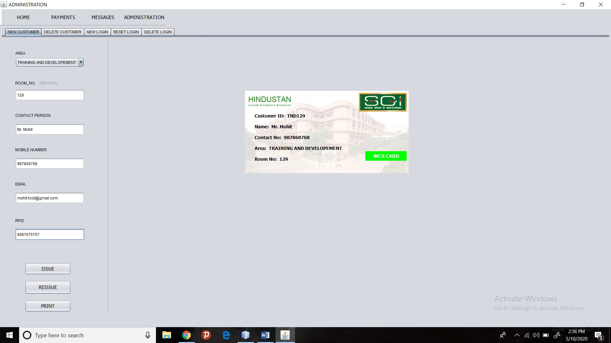

      

  

  

A waste collection system, that can solve the irregularity in daily waste collection, by proper monitoring using a software application installed at the hub and two mobile applications installed in the mobile phones of waste collector and users for collection and everday updates. 
The software is mainly developed using java language and the mobile application using Flutter.
